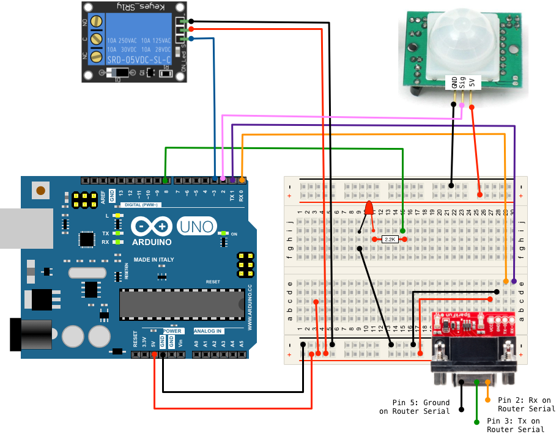
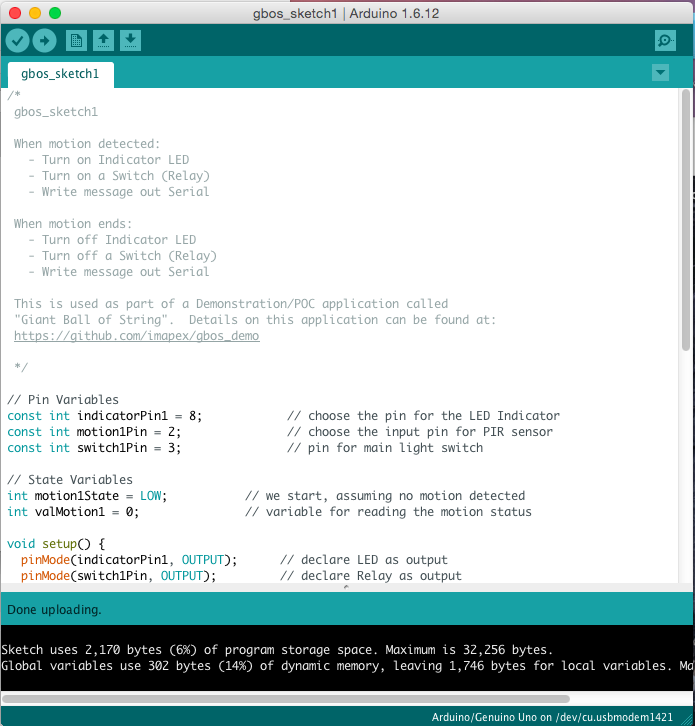
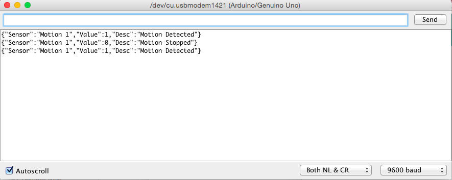

# Giant Ball of String: Arduino

Giant Ball of String (GBoS) is a sample demonstration applicaiton that illustrates how several technologies from Cisco can be brought together to address a business problem.  

## Demo Application Background

All across the United States, there are roadside attractions like *The Worlds Largest Fork*, *The Biggest Donut*, and *The Giant Ball of String*.  The organization that manages these attractions is facing pressure to provide better metrics and details about the visitors to the attractions, and to provide a better experience for those visitors.  If they can't meet this demand, they may see their funding reduced.  

To address this problem, the technical staff has built their next generation attraction support platform.  This platform provides the following capabilities:

* Monitor activity at each site using motion detectors.  
* Turn on lights, signage, and resources at each site only when vistors are present
* Provide centralized logging of visits at all attractions
* Informational Kiosks at each attraction 
* Direct interaction with visitors by providing facts and Q/A through their mobile devices

## Full Demo Details

This repository and README provide details on setting up just the gbos_arduino code and circuit.  More details available at: 

* [gbos_demo](https://github.com/imapex/gbos_demo) - Full Demo Application Setup and Details
* [gbos_iox](https://github.com/imapex/gbos_iox) - Details on the Cisco IOx Client Application 
* [gbos_arduino](https://github.com/imapex/gbos_arduino) - Details on the Arduino Microcontroller Code 

---

# gbos_arduino 

This repository provides the code and details for the [Arduino](https://www.arduino.cc) microcontroller that enables motion detection and control of attraction lighting.  The Arduino running this code is connected via a Serial Interface to a Cisco IOx Router running the [gbos_iox](https://github.com/imapex/gbos_iox) application.  

### Table of Contents 

* [Setup and PreRequisites](#setup-and-prerequisites)
* [Loading Demo Application](#loading-demo-application)
* [Connecting the Arduino and Router](#connecting-the-arduino-and-router)

# Setup and PreRequisites 

## Arduino 

The great part about the Arduino platform is the large number of boards to use that, for the most part, are compatible with each other, including sketchs (an Arduino program).  A common Ardunio to use for projects focused on learning and demonstrations is the Arduino UNO, which was used here.  

In addition to the Arduino board itself, you'll need a few other things to complete the external sensor circuit.  These include: 

* Push Button

* PIR Motion Detector
* LED Light (for indication)
* Resistors (for LED)
* Breadboard (optional but very handy)
* Breadboard jumpers
* Arduino Power Supply
* Relay (to act as switch powering lights)

### Parts List 

The following parts list and links are provided for information and as a reference.  Any similar components will work.  

| Description | Link | 
| ----------- | ---- | 
| Arduino Uno | [Adafruit](https://www.adafruit.com/products/50) |
| Arduino Power Supply | [Adafruit](https://www.adafruit.com/products/63) |
| Arduino Uno USB Cable | [Adafruit](https://www.adafruit.com/products/62) |
| Breadboard | [Adafruit](https://www.adafruit.com/products/64) |
| Jumpers | [Adafruit](https://www.adafruit.com/products/153) |
| LED | [Adafruit](https://www.adafruit.com/products/299) |
| 2.2K Resistor - LED | [Adafruit](https://www.adafruit.com/products/2782) |
| PIR Motion Detector | [Adafruit](https://www.adafruit.com/product/189) | 
| Relay - AC 10Amp 250VAC | [Amazon](https://www.amazon.com/Relay-Module-Arduino-Official-Boards/dp/B0100A6KFS) | 

Alternatively, you can order an Arduino Starter Kit that includes most of the above and more.  

*PIR Motion Detector and Relay not included in most starter kits*

[Adafruit Arduino Starter Pack](https://www.adafruit.com/products/68)

*Links to Adafruit and Amazon above are purely for reference.  We will receive no money if you use them.*

#### Arduino Serial TTL to RS232 

The Arduino Serial communciations operate using TTL, while the IOx router uses RS232.  These mechanisms are NOT directly compatible, and attempts to do so can damage your Arduino.  You can translate between them using a few different methods.  For this demo, I used an RS232 Shifter available from Sparkfun to make it simple and easy.  

| Description | Link | 
| ----------- | ---- | 
| RS232 Shifter | [Sparkfun](https://www.sparkfun.com/products/449) |
| DB9 Breakout | [Amazon](https://www.amazon.com/Swellder-Breakout-Terminals-Connector-Terminal/dp/B00Z2LIHAC) |

*Links to Sparkfun and Amazon above are purely for reference.  We will receive no money if you use them.*

### Component Diagram 

# Loading Demo Application

## Arduino Sample Sketch 

Before loading the Sample Sketch onto your Arduino, be sure to have built the electrical circuit as shown in the [Component Diagram](#component-diagram).  

*See  for information on full details using the Arduino IDE.  The steps below assume some familiarity with the process of programming and Arduino*

1. Open `gbos_sketch1.ino` in the Arduino IDE.  
2. Make sure your Ardino board and port are configured.  
3. Upload the Sketch to your Arduino.  

	

4. Verify that Arduino is configured properly by opening the Serial Monitor within the IDE and wave your hand in front of the motion sensor.  You should see messages logged.    

	

5. Disconnect the USB Cable from the Arduino used to program.  Be sure another power adapter or supply is connected still.  

# Connecting the Arduino and Router

Depending on the exact type of Serial interface and cable you are using with your router, you may need to update these details.  But if your router serial cable provides a Female DB25 connector (as was used in this demo build) you will use these pin connections.  

* **Pin 2 - Receive** connected to **RS232 Shifter Pin 2: Tx**
* **Pin 3 - Transmit** connected to **RS232 Shifter Pin 3: Rx** 
* **Pin 7 - Ground** connected to **RS232 Shifter Pin 5: Ground**